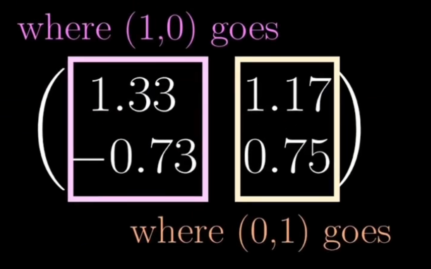
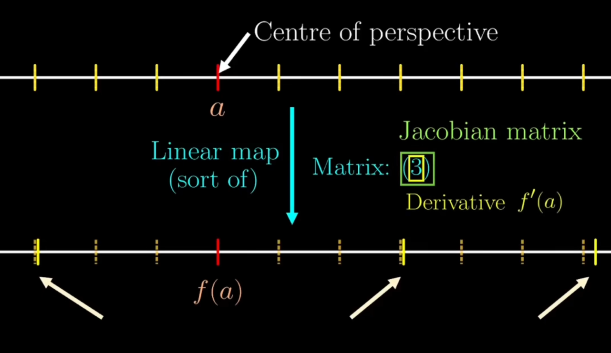

# 导数与积分的本质：从线性映射到雅可比矩阵

对于导数，我们总是停留在“斜率”这个概念，一直用在某一点的变化率来定义，现在从线性变化的角度来理解整个导数以及jacobian矩阵

## 线性映射的本质

### 二维线性映射的矩阵表示

线性映射可以通过矩阵来完全确定，通过原始坐标系中的基准点，在经过变化之后的新坐标的位置，就可以确定线性映射，例如：

我们取坐标系中的基准点 $(0,1)$，以及 $(1,0)$，在经过坐标系的变化之后，$(1,0)$ 映射到了点 $(1.33, -0.73)$ 以及 $(0,1)$ 映射到了 $(1.17,0.75)$，这些坐标构成矩阵，描述线性映射的本质：

这是一个从 ($\mathbb{R}^2 \to \mathbb{R}^2$) 的线性映射 ($T$)。已知标准基

$$
e_1=(1,0),\quad e_2=(0,1)
$$

在该映射下的像分别为

$$
T(e_1)=\begin{pmatrix}1.33\\\\
-0.73\end{pmatrix},\qquad
T(e_2)=\begin{pmatrix}1.17\\\\
0.75\end{pmatrix}.
$$

线性映射在标准基下对应的矩阵就是“列向量分别是基向量的像”：

$$
A=\begin{pmatrix}
1.33 & 1.17\\\\
-0.73 & 0.75
\end{pmatrix},
\qquad T(\mathbf{x})=A\mathbf{x}.
$$

因此对任意输入向量 $\mathbf{x}=\begin{pmatrix}x,y\end{pmatrix}$，映射公式为

$$
T\left(\begin{pmatrix}x\\\\
y
\end{pmatrix}\right) =
\begin{pmatrix}
1.33x+1.17y\\\\
-0.73x+0.75y
\end{pmatrix}
$$

### 行列式(Determinant)：线性映射的缩放因子

线性映射对二维区域的面积按固定比例缩放，该缩放因子称为行列式。若映射包含反射，行列式为负（表示取向翻转）。二维矩阵行列式计算为：主对角线元素乘积减去副对角线元素乘积。

对二维线性映射 $T(\mathbf{x})=A\mathbf{x}$，若

$$
A=\begin{pmatrix}a&b\\\\c&d\end{pmatrix}
$$
那么行列式的计算公式就是
$$
\det(A)=ad-bc.
$$

### 一维的线性映射

一维线性映射本质是缩放操作，矩阵简化为单个缩放因子（数值）。此时行列式即该缩放因子，代表长度的缩放比例。

## 函数的局部线性近似

我们理解了线性映射之后，我们在从线性映射的角度来理解导数，我们对于一个函数上的一点 $a$，有一个映射 $f(x)$，我们想知道 $a$ 在 $f(a)$ 附近的表现，我们通过观察点 $a$ 周围的点在新映射之后相对于 $f(a)$ 的相对的位置，就可以知道函数在点 $a$ 处的缩放比例，这个可以理解为在点 $a$ 处的导数，

## 二维函数的雅可比矩阵

二维函数（两个输入、两个输出）可视为坐标平面的变换，在点 (a,b) 附近放大后，局部行为近似线性映射，对应的矩阵称为雅可比矩阵。雅可比矩阵依赖于点 (a,b)，其元素通过偏导数计算：分解函数为两个分量 f1、f2，固定一个输入求另一个输入的导数，得到矩阵的各个元素。

雅可比矩阵的定义在点 $(a, b)$ 处，雅可比矩阵 $J$ 收集了所有的一阶偏导数。每一行对应一个输出分量，每一列对应一个输入变量：

$$J_{(a,b)} = \left.\begin{bmatrix} \frac{\partial f_1}{\partial x} & \frac{\partial f_1}{\partial y} \\\\ \frac{\partial f_2}{\partial x} & \frac{\partial f_2}{\partial y} \end{bmatrix}\right|_{(a,b)}
$$
 
局部线性近似公式这是雅可比矩阵的核心用途。如果我们从点 $(a, b)$ 稍微移动一点点距离 $(\Delta x, \Delta y)$，输出的变化量 $(\Delta u, \Delta v)$ 可以用矩阵乘法近似计算：

$$\mathbf{f}(a+\Delta x, b+\Delta y) \approx \mathbf{f}(a, b) + \underbrace{\begin{bmatrix} \frac{\partial f_1}{\partial x} & \frac{\partial f_1}{\partial y} \\\\ \frac{\partial f_2}{\partial x} & \frac{\partial f_2}{\partial y} \end{bmatrix}}_{\text{线性变换矩阵 } J} \cdot \begin{bmatrix} \Delta x \\ \Delta y \end{bmatrix}
$$

简而言之：在微观尺度下，非线性函数 $\mathbf{f}$ 变成了一个线性乘法 $J$。

## Reference

- [What is Jacobian? | The right way of thinking derivatives and integrals](https://www.youtube.com/watch?v=wCZ1VEmVjVo&t=10s)

