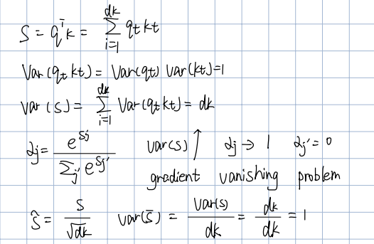

# Attention

## How to explain attention?
Imagine each token is holding three things:
* a query: what am I looking for?
* a key: what kind of imformation do I contain?
* a value: what actual information can I provide?

## Why multihead?
Single head learns only one interaction pattern at a time, Multi-head lets the model look at the sequence from multiple subspace.

## Where to add mask?
The mask is added before softmax

## Why do we divide by 𝑑𝑘?
The variance of the dot product grows with dk

## Why not use K directly instead of V?
K represent matching space, and V represent content space, they are different in semantic space

## Common engineering issues and solutions

### O(L2) memory blow-up
* KV cache
* usually use Flashattention

### numerical instability in softmax
Use stable softmax:
$$softmax(xi​)=∑j​exj​−max(x)exi​−max(x)​$$

### Tensor Layout
X:B×L×dmodel​
Q,K,V:B×h×L×dk​
A:B×h×L×L
Z:B×h×L×dv​