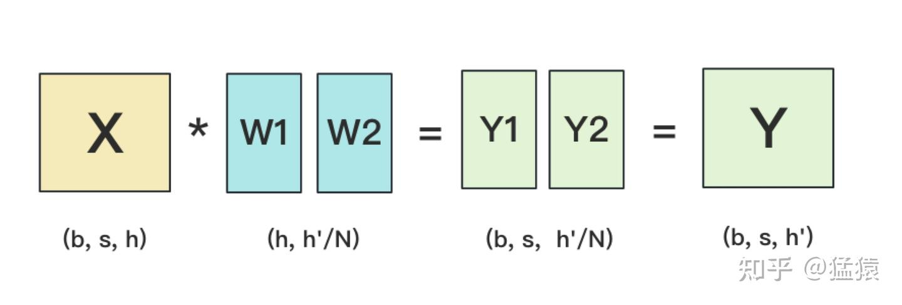
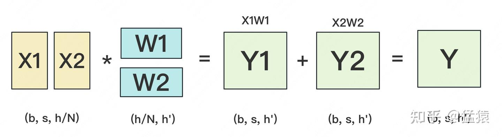

# 推理过程中的Tensor Parallel 张量并行的切分

接下来的内容讲述为什么在进行张量并行的时候需要按照互补切分的方式来对我们的权重矩阵进行切分

首先我们提出几个问题：
- 为什么要进行切分？
- 如何切分？
- 为什么要“互补切分”？
- 切分完之后如何做foward以及backward?（这个部分之后再讲）

### 问题1：为什么要进行切分?

因为权重太大了，单个GPU的显存装不下，所以我们需要将模型通过切分的方式，将权重平均的分配到多个GPU上

### 问题2：如何切分？

#### 先从最基本的一次矩阵乘法开始

设：

* 输入 $X \in \mathbb{R}^{B \times d_{\text{in}}}$
* 权重 $W \in \mathbb{R}^{d_{\text{in}} \times d_{\text{out}}}$
* 输出 $Y = XW \in \mathbb{R}^{B \times d_{\text{out}}}$
在TP中有两种切分方法，一个是按行切分，另一个是按列切分，我们用矩阵的形式表示出来就是：

#### Column Parallel（按列切 W：切输出维度）

把 $W$ 的列（也就是 $d_{out}$）切到 $p$ 张卡上：
$$
W=[W^{(1)}, W^{(2)}, \dots, W^{(p)}],\quad W^{(i)}\in\mathbb{R}^{d_{in}\times (d_{out}/p)}
$$
每张卡算：
$$
Y^{(i)} = X W^{(i)} \in \mathbb{R}^{B\times (d_{out}/p)}
$$

如果想要完整 $Y$，需要 all-gather 把 $Y^{(i)}$ 拼起来，图像展示就是：

#### Row Parallel（按行切 $W$：切输入维度）
把 $W$ 的行（也就是 $d_{in}$）切到 $p$ 张卡上，同时输入 $X$ 也按列切：
$$
W=\begin{bmatrix}
W_{(1)} \\
\vdots \\
W_{(p)}
\end{bmatrix},\quad W_{(i)} \in \mathbb{R}^{(d_{in}/p)\times d_{out}}
$$

$$X=[X^{(1)},\dots,X^{(p)}],\; X^{(i)} \in \mathbb{R}^{B\times (d_{in}/p)}$$
每张卡算局部贡献：
$$Z^{(i)} = X^{(i)} W_{(i)} \in \mathbb{R}^{B\times d_{out}}$$
完整输出是求和：
$$Y = \sum_{i=1}^{p} Z^{(i)} \in \mathbb{R}^{B\times d_{out}}$$
所以需要一次 all-reduce(sum)，图像展示就是：

在 vLLM（以及 Megatron-LM 风格的 Tensor Parallel）里说的“互补切分（complementary sharding）”，核心目的只有一个：
> **让相邻两次矩阵乘法的中间激活 $H$ 保持“分片状态”不需要 all-gather**，把通信压到最少（通常只剩下一次 all-reduce）。

---
#### 问题3 为什么要“互补切分”？

Transformer 的 MLP 本质是两次线性（中间有激活函数）：
$$
H = X W_1,\quad Y = \phi(H) W_2
$$
设维度：

* $X\in\mathbb{R}^{B\times d}$
* $W_1\in\mathbb{R}^{d\times m}$（扩张到 $m$，比如 $m=4d$）
* $W_2\in\mathbb{R}^{m\times d}$（再投回 $d$）

---

#### 互补切分的做法：$W_1$ 列切 + $W_2$ 行切

第1层：对 $W_1$ 做 Column Parallel（切输出维 $m$）

$$
W_1=[W_1^{(1)},\dots,W_1^{(p)}],\quad W_1^{(i)}\in\mathbb{R}^{d\times (m/p)}
$$
每卡得到：
$$
H^{(i)}=XW_1^{(i)}\in\mathbb{R}^{B\times (m/p)}
$$
注意：**$H$ 按 hidden 维（$m$）分片**。

激活：$\phi$ 是逐元素的

$$
\phi(H^{(i)})
$$
仍然只依赖本地分片，所以激活不需要通信。

第2层：对 $W_2$ 做 Row Parallel（切输入维 $m$）

把 $W_2$ 按行切（对应输入维 $m$）：
$$
W_2=\begin{bmatrix}
W_{2(1)} \\
\vdots \\
W_{2(p)}
\end{bmatrix},\quad W_{2(i)}\in\mathbb{R}^{(m/p)\times d}
$$
每卡正好拿自己的那段输入 $\phi(H^{(i)})$，直接算局部输出：
$$
Z^{(i)}=\phi(H^{(i)}) W_{2(i)} \in \mathbb{R}^{B\times d}
$$
最后合并：
$$
Y=\sum_{i=1}^{p} Z^{(i)} \quad \Rightarrow \quad \text{一次 all-reduce(sum)}
$$

**结论：中间激活 $H$ 全程保持分片，不需要 all-gather。**

---

#### 如果不互补：两层都用 Column Parallel

* 第1层 Column：得到 $H^{(i)}$（分片的）
* 但第2层如果也 Column Parallel（切输出维 $d$），每张卡计算 $Y^{(i)}=\phi(H)\,W_2^{(i)}$

问题是：算 $Y^{(i)}$ 需要完整的 $\phi(H)\in\mathbb{R}^{B\times m}$，而你手里只有 $\phi(H^{(i)})$。
于是你必须先：
$$
\phi(H) = \text{all-gather}(\phi(H^{(1)}),\dots,\phi(H^{(p)}))
$$
这一步通信非常大（$B\times m$ 级别），推理延迟会被拉爆。

同理，如果两层都 Row Parallel，也会在层间需要别的形式的通信/重分布，不能做到“中间不通信”

此外，我们一般都会采用先使用列切割，再使用行切割的方法，因为我们如果在第一步使用行切割，那么获取最终的结果需要做一次all-reduce操作，这样会产生额外的通讯，如果先使用列切割就不会有这样的问题了

