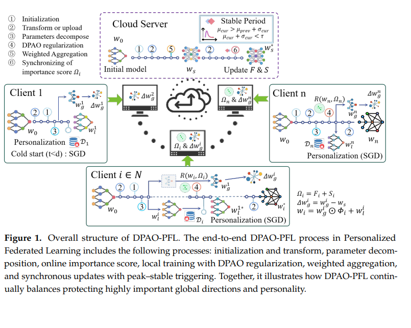

# DPAO-PFL: Dynamic Parameter-Aware Optimization via Continual Learning for Personalized Federated Learning 解读

## 问题提出？

* pFL出现产生了个性化和全局化的矛盾，最终结果想要既要保证个性化的又要全局的通用能力
* non-IID导致更新方向冲突，收敛慢
* CF会导致（跨轮/跨客户端）的知识遗忘

## 如何解决

---

### 1. 全局和个性化如何分隔？

* 使用参数分解 + 门控调制：每层参数拆成「全局 + 门控 + 局部」，
  $$\theta_k = \theta_g^k \odot \phi_k + \theta_l^k$$
  对每一层都做上述分解。

---

### 2. 如何解决 CF？

* 用 EWC 保护共享参数：
  $$\min L_i(w_l, w_g) + \frac{\lambda}{2} \sum_k \Omega_k^{(t-1)} (w_{g,k} - w_{s,k})^2$$
  使本地训练既适配本地数据，又不破坏全局信息。

---

### 3. 不是所有参数同等重要，如何体现重要性？

* 使用动态参数重要性估计：Fisher + path sensitive，
  $$\Omega \approx F + S$$
* 用对角 Fisher 近似衡量参数变化对输出分布的影响；
* 用基于 loss 变化的 path sensitive 做敏感度打分。

---

### 4. 稳定性和个性化难平衡，固定 $\lambda$ 不够

* 动态调节约束强度 $\lambda_t$：
* 训练仍在剧烈波动、需适配新分布时：约束不宜过强（$\lambda_t$ 较小）；
* 训练趋于稳定、共享知识更可信时：加强约束（$\lambda_t$ 增大）。

---

### 5. 通信开销如何控制？

* 只上传共享参数，个性化参数留在本地；
* 重要性估计仅在本地计算，不上传服务器；
* 下一轮下发时使用聚合后的共享参数。

## Limitations

* 文章的动态重要性，动态正则强度部分理论验证不充分，F+S在理论上不一定准确的保证重要性的选择，可能忽略了参数之间的相关性