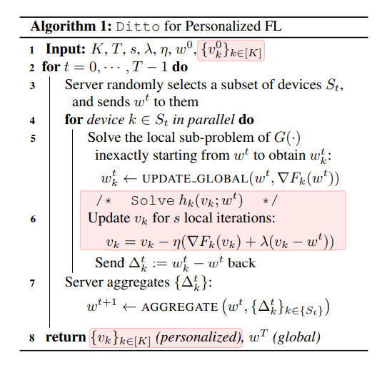

# Ditto: Fair and Robust Federated Learning Through Personalization 解读

## 解释问题
在non-IID的pFL的环境中，fairness和Robustness是一个相互制约的关系，过去的一些文章为了解决这些attacks，使用的robustness的方法牺牲了很多fairness，同样使用的fariness的方法也会使得robust变差，Ditto是用来解决这个问题的。Ditto受mean regularized MTL方法的启发，之前的工作是在优化average personalized model，但是Ditto的目标转为优化global model。并且指出了MTL本身就能够很好的平衡fairness和robustness。引入正则项的方法是为了能够让personalized model更加接近optimal global point，同时在之前提到的robustness和fairness中，文章中的λ提供一个trade off between them，λ越大惩罚越大，更global，λ越小惩罚越小，更personalized。

## 解决方法

### 问题1：如何解决单一global weight 不够公平，不够personalization

**解决方法：** 把“一个模型”变成“全局参考 + 本地个性化”，每个客户端维护私有个性化模型 (v_k)，只把 (w^t) 当“锚点”而不是最终答案，每个被采样客户端 (k) 在本地做两条并行任务：

#### 任务 A：更新全局 (w)

* 初始化临时副本：$w_{\text{local}} \leftarrow w^t$
* 在本地跑 (E) 步 SGD 得到 $w_k^t$
* 上传 $\Delta_k^t = w_k^t - w^t$

#### 任务 B：个性化更新本地最终模型 $(v_k)$

* 用当前全局 $(w^t)$ 作锚点，对 $(v_k)$ 做 $s$ 步更新：

$$v_k \leftarrow v_k - \eta\big(\nabla F_k(v_k) + \lambda(v_k - w^t)\big)$$

---

### 问题 2：公平与鲁棒的强弱随场景变化，需要可调节，而不是固定策略

**解决方法：** 用 $\lambda$ 控制依赖程度，直观的理解就是，当$\lambda$趋近于0，Ditto更加偏向于本地模型，当$\lambda$趋近于正无穷，Ditto更趋向于全局模型

### 问题 3：整个流程是什么样的

**解决方法：** 整个的算法流程如下：
* 随机的选择t个client，并将全局的参数传入这些模型
* 对于每一个device：
  * 训练一个上传到global的参数 $\Delta_k^t = w_k^t - w^t$
  * 并且同时训练一个不上传的本地参数 
    $$v_k \leftarrow v_k - \eta\big(\nabla F_k(v_k) + \lambda(v_k - w^t)\big)$$
* Global对所有上传的参数进行聚合
  

## Global knowledge和personal knowledge
Ditto的global knowledge和personal knowledge是通过他的两套参数来保持的，global knowledge 通过每一轮的下发以及聚合保留了全局的知识，并且ditto的目标是优化这个全局模型，全局的知识保留在这个参数中
对于personal knowledge，client的私有模型承载了所有的知识，由于client是在优化一个正则项的函数，并且是本地不上传的，每一轮基于上一轮进行优化，所以知识得以保留