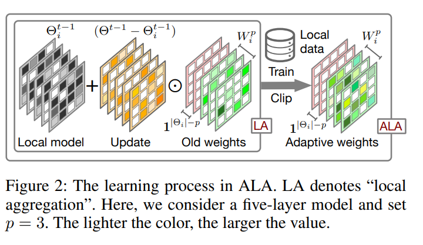

# FedALA: Adaptive Local Aggregation for Personalized Federated Learning 解读

## 问题怎么来的？

* statistical heterogeneity 的经典表现 Non-IID 导致在全局服务器上学习的模型在客户端上泛化性不好
* PFL 为了解决这个问题，优先保证每个本地客户端的模型质量，通过3个类别：
  * 每次在local使用全局模型进行覆盖
  * 额外学习个性化模型
  * 使用个性化的聚合方式
* 前两种导致的问题就是每次获得是 desired information 混合 undesired information
* 第三种出现了几种问题，也就是本文解决的问题
  * 个性化聚合没有在本地做对齐，也就在本地不一定是为了找到 local minimal 的 loss
  * 一些方法需要下载其他 client 的模型，会增加通信开销以及隐私问题
  * 有的方法使用 layer-level + binary 不够精确，并且不一定符合local optimal

## 本文解决的问题总结：
* 在不增加额外通信开销的前提下，捕获全局模型种的 desired information，并且向local objective 方向自适应

## 如何解决

---

### 1. 全部接受全部模型并覆盖会混入 undesired information

**解决方法：** 把覆盖改成「差分注入 + 可学习的吸收比例」

$$\Theta_i^t = \Theta_i^{t-1} + (\Theta^{t-1} - \Theta_i^{t-1}) \odot W_i$$

---

### 2. 现有的个性化聚合方法不能对齐 local objective

**解决方法：** 权重 $W$ 使用本地的 loss 学习

$$W_i^p \leftarrow W_i^p - \eta \nabla_{W_i^p} L(\hat{\Theta}_i^t, D_i^{s,t}; \Theta^{t-1})$$

---

### 3. 别的方法需要下载其他客户端的模型

**解决方法：** 只用「本地 + 全局」的模型，只有一次下载和一次上传。

---

### 4. 现有方法在 personalization 上的粒度太粗

**解决方法：** 权重是 element-wise 的，比 layer-level 更细，并且 clip 到 $[0,1]$。

---

### 5. 有的方法对本地模型的改动非常大，不好迁移

**解决方法：** 整个 ALA 只放在初始化阶段，只改动初始化的位置，不改动其他部分。

---

### 6. DNN 低层信息更泛化，用全部数据学习成本高

**解决方法：** 高层特征更个性化，只在高层学习 $W$ 权重，低层只用全局；并且只用 $s\%$ 的数据以节省时间。
