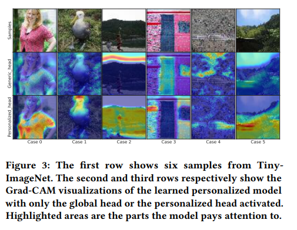
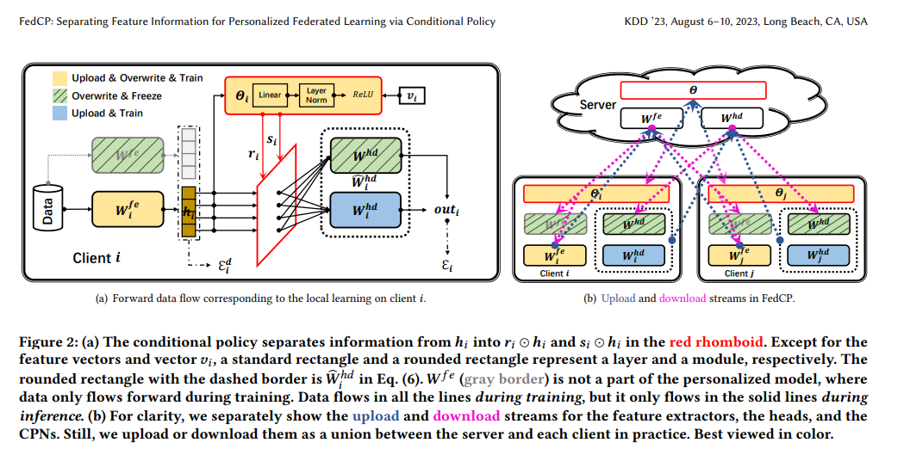

# FedCP: Separating Feature Information for Personalized Federated Learning via Conditional Policy 解读

## 问题提出？

* non-IID 引出 pFL
* 现有方法都是将全局模型当容器，并且主要关注客户端级的参数共享/正则/微调，忽略了本质上的问题：全局/个性化的信息来源于数据，并且数据都是混合在一起的
* 缺少一个方法从特征层面（而不是参数层面），把全局和客户端的信息显式地分离，最好是样本级别的
* Conditional Computing 这个概念有用在别的领域，但是在pFL并没有使用这个想法

## 本文解决的问题总结：

* 现在缺少一种从样本特征的角度显式地分离全局和客户端信息的方法，本文提出使用 conditional computing 概念，在特征维度上分离信息

## 如何解决

---
### 1. 在训练的时候模型在什么地方是要训练的？

从模型层面拆分，分为 **Extractor + Head**：最后的 logits 是 head，其余为 feature extractor。每个客户端维护 5 个模块，客户端 $i$ 同时拥有：

* **全局 extractor** $W_{fe}$
* **全局 head** $W_{hd}$
* **个性化 extractor** $W_i^{fe}$
* **个性化 head** $W_i^{hd}$
* **CPN（Conditional Policy Network）** 参数 $\Theta_i$

---

### 2. 模型是如何做样本级「特征分离」的？

对于全局的 extractor 和 head 都冻结住，然后对个性化的部分使用 CPN，生成对每个维度都做决策的 $r$, $s$，在特征向量上分离给 global 和 local，输出为双 head 之和。

这个图解释了 global feature extractor 和 personalized feature extractor 的特征提取的注重点都在哪里。

---

### 3. 如何保证 global head 冻结之后还能读懂 personalization 提取的特征部分？

文章使用 MMD 对齐，缓解本地训练导致的输出特征漂移，使 frozen 的权重仍能正确解读个性化特征。

---

### 4. 整个的过程是怎样的

每一轮（server → client → server）：

* **Server 下发：** $W_{fe}$, $W_{hd}$, $\Theta$

* **Client Overwrite：** 用 $W^{fe}$ 初始化 $W_i^{fe}$，用 $W_{hd}$, $\Theta$ 覆盖本地对应块

* **Client Freeze：** 冻结 $W^{fe}$, $W^{hd}$

* **Client Forward：**
  * $h_i = f(x; W_i^{fe})$
  * 计算 $v_i$ 并构造 $C_i$，CPN 输出 $r_i$, $s_i$
  * 特征分离：$r_i \odot h_i$、$s_i \odot h_i$
  * 双 head 输出相加：$\text{out}_i$
  * 用冻结 $W^{fe}$ 生成参照特征，算 MMD

* **Client Backward/Update：** 只更新 $W_i^{fe}$, $W_i^{hd}$, $\Theta_i$（全局两块不动）

* **Client Upload：** 上传 $W_i^{fe}$, $W_i^{hd}$, $\Theta_i$

* **Server Aggregate：** 聚合得到新 $W^{fe}$, $W^{hd}$, $\Theta$ 进入下一轮

---

### 5. 训练和推理走的参数有何区别

推理时个性化模型为：

$$W_i = \{ W_i^{fe},\; W^{hd},\; W_i^{hd},\; \Theta_i \}$$

冻结的全局 extractor $W^{fe}$ 只用于训练时的 MMD 对齐，推理时不使用（即图中灰边框那块）。

## Limitations

FedCP 的主要局限是：它依赖样本级策略网络（CPN）与 MMD 对齐等额外组件和超参数（如 𝜆）在特定分类/双-head设定下工作，带来一定通信/实现复杂度且对调参敏感，并且未提供形式化的隐私或持续学习式抗遗忘保证。