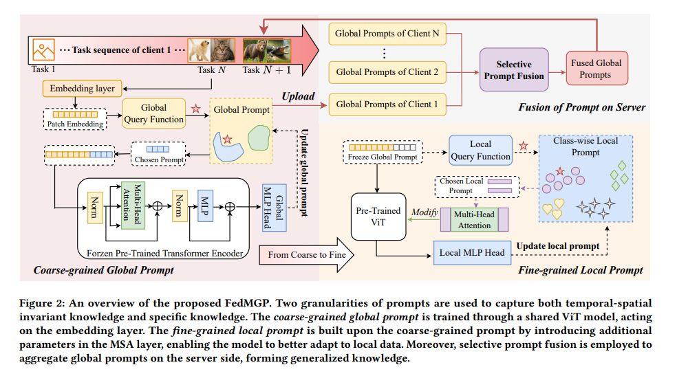

# Personalized Federated Continual Learning via Multi-granularity Prompt 解读

## 问题提出？

PFCL中需要解决几个问题：
* 服务器端融合更泛化的知识，避免因异构导致的 spatial catastrophic forgetting
* 客户端减少持续学习带来temporal forgetting
* 客户端的个性化适配：让全局知识在本地更好的应用

## 核心策略

把知识拆成两层 prompt：coarse-grained global prompts（共享、可聚合） + fine-grained local prompts（类级细节、只留本地），服务器只融合 global prompts，并用 selective prompt fusion 做更稳的共享知识迁移

## 如何解决？

---

### 1. 如何在异构的客户端之间做共享知识融合，减少空间遗忘？

**解决方法：** Coarse-grained Global Prompt（全局粗粒度 prompt）：不直接聚合整个模型参数，在冻结的 ViT 上学习一个 global prompt pool，共享知识存于这些 prompt 向量中。

---

### 2. 这组 prompt 如何在输入中使用？

**解决方法：** 维护一个 prompt 池；对输入 $x$ 先做 embedding，再选出 $N$ 个 prompt 拼接到 embedding 前。

---

### 3. 如何为输入 $x$ 选择合适的 prompt？

**解决方法：** 用 key-value 方式做匹配。每个 prompt 配一个 key $K_g^j$；输入也生成一个 key $K_{\text{in}} = V(E)$。在所有 key 中找与 $K_{\text{in}}$ 最相似的 top-$N$ 个，取对应的 prompts。

---

### 4. 客户端在持续学习时如何减少遗忘？

**解决方法：** local prompt pool 按类别组织：

$$\mathcal{P}_l = \{(K_l^1, P_l^1), \ldots, (K_l^C, P_l^C)\}$$

即每类一个 prompt；新任务到来时，模型把先前任务的重要细节绑定到对应 prompt 上。

---

### 5. 如何把 prompt 注入到 local model 中？

**解决方法：** local prompt 不拼到输入，而是作为每层 attention 的 key/value 前缀插入：

$$\text{MSA}(h_q, h_k, h_v) \rightarrow \text{MSA}'(h_q, [p_K; h_k], [p_V; h_v])$$

---

### 6. 这样如何最终实现模型个性化？

**解决方法：** global prompt 提供跨 client 的共享信息，local prompt 提供跨任务的细节信息；server 不聚合 local prompt，从而保留各客户端的个性化。

## Limitation

* 如果任务数量变多，多粒度的prompt会带来额外的存储以及路由的复杂度，并且在任务边界模糊或者高度non-IID的情况下，可能出现prompt失配的问题