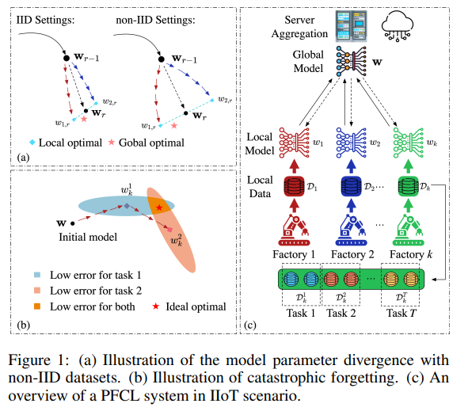

# FedMeS: Personalized Federated Continual Learning Leveraging Local Memory 解读

## 问题提出？

* 已有工作（如 FedWeIT）通过参数分解做 FCL，但在数据异构场景下表现吃力，且无法解决任务可扩展性：只缓解「遗忘」不缓解「漂移」，任务增多后参数隔离越来越重。

## 如何解决

---

### 1. CF（catastrophic forgetting）怎么解决？

* 每个客户端保留一部分旧任务样本，用于后续训练与推理。
* 引入梯度内积约束：仅当当前任务梯度与记忆梯度不冲突时才更新，
  $$\langle \nabla L(w_k^t; D_k^t), \nabla L(w_k^t; M_k^t) \rangle \geq 0$$
* 若冲突，则按 A-GEM/GEM 做投影修正。

---

### 2. Client drift（异构导致全局模型对部分客户端无用）怎么解决？

* 在个性化目标中加入「靠近全局模型」的正则项：
  $$\lambda \|w_k^t - w\|$$

---

### 3. 推理时不知 task-id（task-oblivious）且要提升个性化，怎么做？

* 推理时用 local memory 做 KNN + Gaussian inference。
* 将「记忆预测」与「模型预测」做插值融合：
  $$\text{FedMeS}_k(x) = \theta_k b_{w_k^t}(x) + (1-\theta_k) h_{w_k^t}(x)$$
