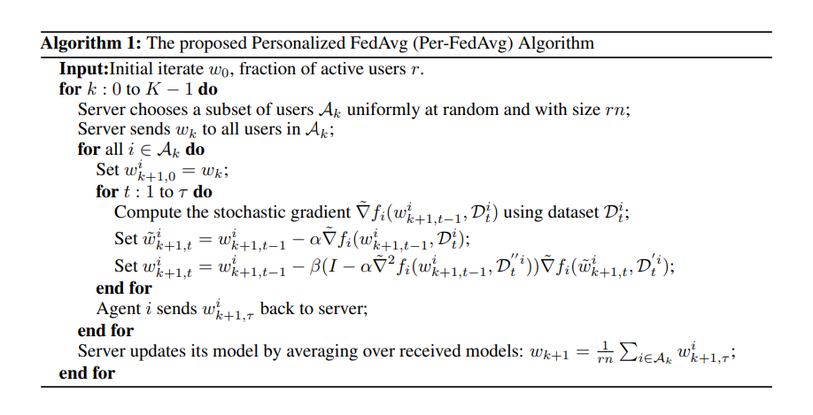

# Personalized Federated Learning with Theoretical Guarantees: A Model-Agnostic Meta-Learning Approach 解读
  
## 问题详细阐述

传统的Fedavg是在解决一个FL的问题，方法是优化一个全局的损失函数，这种方法会使得client模型不能够适配，即使后续在本地继续优化几步可能还是不够（因为数据异质性的问题），所以Per-FedAvg尝试使用一种方法，通过改变整个学习的目标，不再是求解一个FedAvg形式的最小值，而是改变成为学习一个共享的初始化，然后每个用户通过本地的一两次的微调就可以收敛到本地的最优。

另外一点是meta-learning范式如果直接搬到FL的情况下会出现问题，一个是FL情况下，client需要做多次本地更新，然后再传回global，在MAML结构中，直接照搬会需要每一步inner-loop都和globa进行通信，要么就是本地多步更新的连乘的梯度。

## 解决方法

### 问题1：FedAvg 目标只关心 (f_i(w))，不关心本地适配后效果

**解决方法：** 把目标改为 MAML 形式（一步适配后的平均损失）
$$
F(w)=\frac1n\sum_{i=1}^n f_i\big(w-\alpha\nabla f_i(w)\big) \tag{3}
$$

### 问题 2：Global无法使用server数据，应该怎么求上述式子

**解决方法：** 定义每个用户的 meta-function
$$ F_i(w)=f_i\big(w-\alpha\nabla f_i(w)\big) $$

### 问题 3：对于每个client怎么求解上式

* 初始化：$(w^i_{k+1,0}=w_k)$
* 做 (\tau) 次本地 meta-SGD：
  $$
  w^i_{k+1,t}=w^i_{k+1,t-1}-\beta,\widetilde{\nabla}F_i(w^i_{k+1,t-1}) \tag{7}
  $$

$$
\big(I-\alpha\widetilde{\nabla}^2 f_i(w,D''_{i,t})\big)
\widetilde{\nabla} f_i\Big(w-\alpha\widetilde{\nabla} f_i(w,D_{i,t}),;D'_{i,t}\Big) \tag{8}
$$

按照两步执行：

1. inner：$\tilde w=w-\alpha \widetilde{\nabla} f_i(w,D_{i,t})$
2. outer：$w\leftarrow w-\beta (I-\alpha \widetilde{\nabla}^2 f_i(w,D''))\widetilde{\nabla}f_i(\tilde w,D')$

### 问题 4：server 聚合：如何得到下一轮初始化？

**解决方法：** FedAvg 式平均
$$
w_{k+1}=\frac{1}{rn}\sum_{i\in A_k} w^i_{k+1,\tau}
$$

## Global knowledge和personal knowledge
从这个角度理解meta-learning，从global的角度上来说，Per-FedAvg保留的global信息是所有用户共享的初始化的参数，这个参数因为是通过每个用户的训练之后得到再进行fedavg式的聚合的，所以能够保留全局的信息

然后从local的角度上讲，Per-FedAvg的client通过共享的初始化由本地数据快速适配得到的，并且在本地保留，所以不会在聚合的时候被平均抹掉