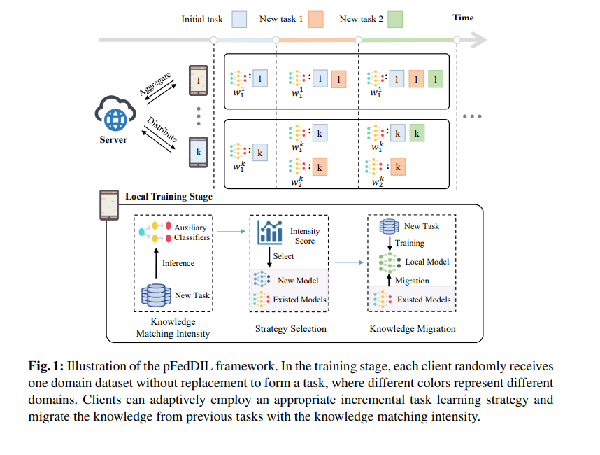

# Personalized Federated Domain-Incremental Learning based on Adaptive Knowledge Matching 解读

## 问题提出？

* Federated Domain-Incremental Learning(FDIL)里任务是“数据域变了，但是类别不变”，Federated ClassIncremental Learning(FCIL)里任务是“新增类别”，本文主要解决第一类问题
* 已有方法1：每个任务单独训练一个模型，存储/训练成本高，
* 已有方法2：一个模型通吃，连续训练会出现 catastrophic forgetting
* FDIL任务中不同域之间存在共享特征，可以迁移共同的知识

## 如何解决

---

### 1. 如何识别任务之间的相关性？

**解决方法：** 每个客户端维护最多 $d$ 个个性化模型，每个模型配一个辅助分类 head。

* **新任务到来时（任务级）：** 将新任务样本分别输入各辅助分类器，取平均得到与每个旧模型的相关性向量 $\tilde{\rho}$，用于决定复用哪个模型 / 是否开新模型。
* **推理时（样本级）：** 对单个样本用辅助分类器输出做归一化权重 $\hat{\alpha}$，加权融合多个模型的预测（类似 MoE gating）。



### 2. 对于新任务如何知道需不需要开新模型？

**解决方法：** 如果新任务在之前的辅助分类器上的输出与所有模型都不像，则开新模型；否则复用最像的旧模型。

---

### 3. 复用/新模型如何缓解 catastrophic forgetting？

**解决方法：** Knowledge Migration (KM) loss 是作者提出的一种 regularization 方法：

$$L_{\text{Local}}^k(w_{t+1}^k) = L_{t+1}^k(w_{t+1}^k) + L_{\text{KM}}^k(w_{t+1}^k)$$

$$L_{\text{KM}}^k(w_{t+1}^k) = \sum_{i=1}^{d} \rho_i \cdot \|w_{t+1}^k - w_i^k\|_2^2$$

---

### 4. 训练辅助分类器会不会引入额外开销？

**解决方法：** 每个模型并未增加额外可训练参数，与 FedCP 类似：前面 feature 提取部分保持不变，最后 FC 层拆成：
```
ResNet18 backbone (除最后FC外的层)
        │
      feature
     ├───────── FC_main  → 多类 logits（正常分类）
     └───────── FC_aux   → 二类 logits（辅助分类器）

```

## Limitations

* 整个框架以及流程非常依赖于两个假设，一个是任务之间存在相关性，特别在这里是分类的类别都不变，如果任务之间完全不相关，则整个框架会出现问题
* 严格采取了no-replay的方法，不回看旧数据，如果有回看旧数据的方法在这个框架上没有做研究
  